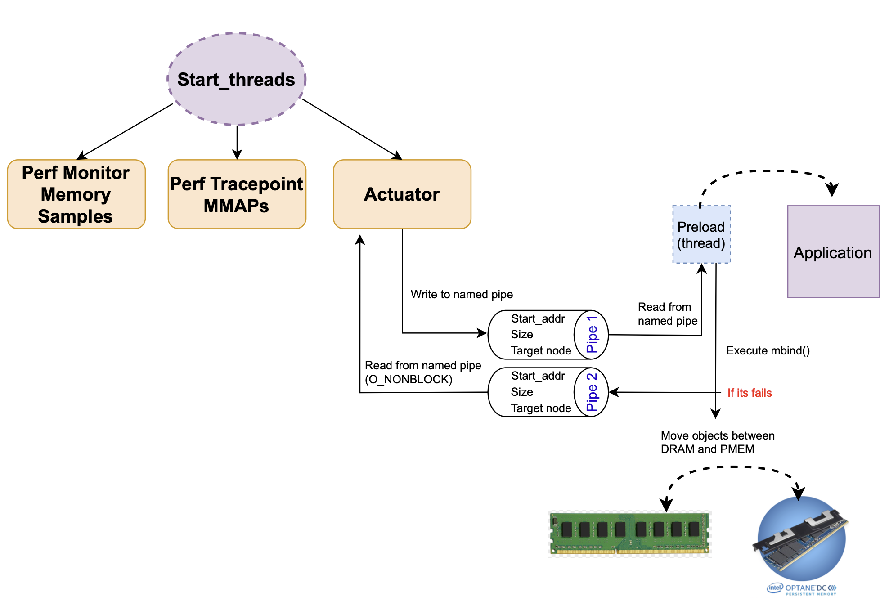

# Start_threads

- Instancia a estrutura de dados que será compartilhada entre todas as threads
  * tier_manager_t g_tier_manager;
  * volatile sig_atomic_t g_running = 1;
- Inicia/encerra todas as threads

# Intercept_mmap

- Intercepta os mmaps de um dado PID e registra na estrutura de dados através do módulo recorder
- Intercepta também as desalocações e registra na estrutura de dados através do módulo recorder

# Monitor

- Habilita/desabilita a leitura dos samples
- Contabiliza samples por objetos

# Actuador

- Implementa diferentes políticas de dataplacement inicial
- Implementa diferentes políticas de cálculo de hotness
- Implementa política de promotion/demotion

# Track_decisions

- Imprime o percentual de páginas alocadas em cada nodo para todos os objetos a cada intervalo de tempo
