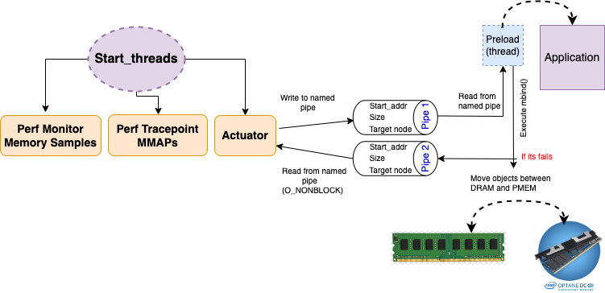

<a href="design.pdf" class="image fit"></a>


# Start_threads

- Instancia a estrutura de dados que será compartilhada entre todas as threads
  * tier_manager_t g_tier_manager;
  * volatile sig_atomic_t g_running = 1;
  * Todos os outros módulos referenciam usando o comando extern 

# Intercept_mmap

- Intercepta os mmaps de um dado PID e registra na estrutura de dados através do módulo recorder
- Intercepta também as desalocações e registra na estrutura de dados através do módulo recorder

# Monitor

- Habilita/desabilita a leitura dos samples
- Contabiliza samples por objetos

# Actuador

- Implementa diferentes políticas de dataplacement inicial
- Implementa diferentes políticas de cálculo de hotness
- Implementa política de promotion/demotion
  * O atuador apenas envia os dados para que o preload realize o bind. Isso porque o bind não pode ser chamada por um processo externo.

# Track_decisions

- Imprime o percentual de páginas alocadas em cada nodo para todos os objetos a cada intervalo de tempo

# Requirements/installations

```console
[root@dmoura]# apt-get install numactl libnuma-dev libpthread* libpfm4*
```

Compilar o perf para instalar os headers and after install the files will be in: /include/

```console
[root@dmoura]# cd /linux/tools/lib/perf
[root@dmoura]# make
[root@dmoura]# make install
```

# Adaptations for Emulated NVM

- In the actuator thread replace **NODE_0_PMEM** by **NODE_1_DRAM**.

- In the monitor thread comment out the line **is_served_by_local_pmem** and enable the line **is_served_by_remote_memory** .

```console
else if (is_served_by_local_pmem(data_src))
else if (is_served_by_remote_memory(data_src))
```

- Change the number of threads and cpus identification

```console
export OMP_NUM_THREADS=18
export OMP_PLACES={0}:18:2
export OMP_PROC_BIND=true
```

