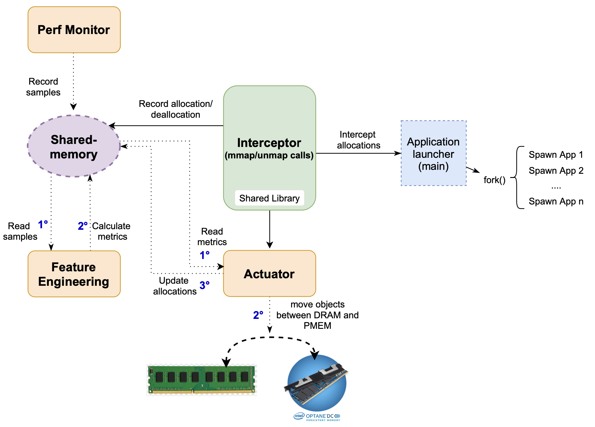
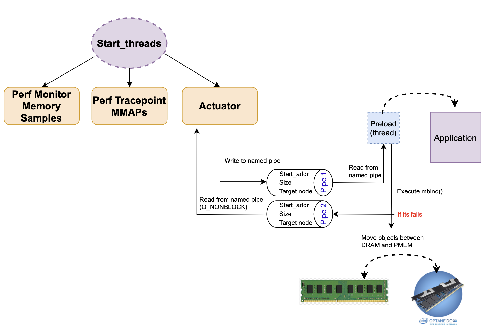

Tasks

- Coletar samples nos demais cores [Vinicius]
- Implementar 3 estratégias de alocação inicial (Random, Round-robin, First fill all in DRAM) [Diêgo]
- Resolver erros de migração do atuador no final da execução [Vinicius]
- Implementar uma política inicial de migração baseado no LLCM [Diêgo]

O branch "no_lock" muda radicalmente a implementação do esclaonador online. Dentre as principais alterações estão:

- Remoção do ring buffer
- Cancelamento do módulo sample processor
- Não uso de shared_memory para comunicação entre os processos
- Uso de Named pipes, sem locks

